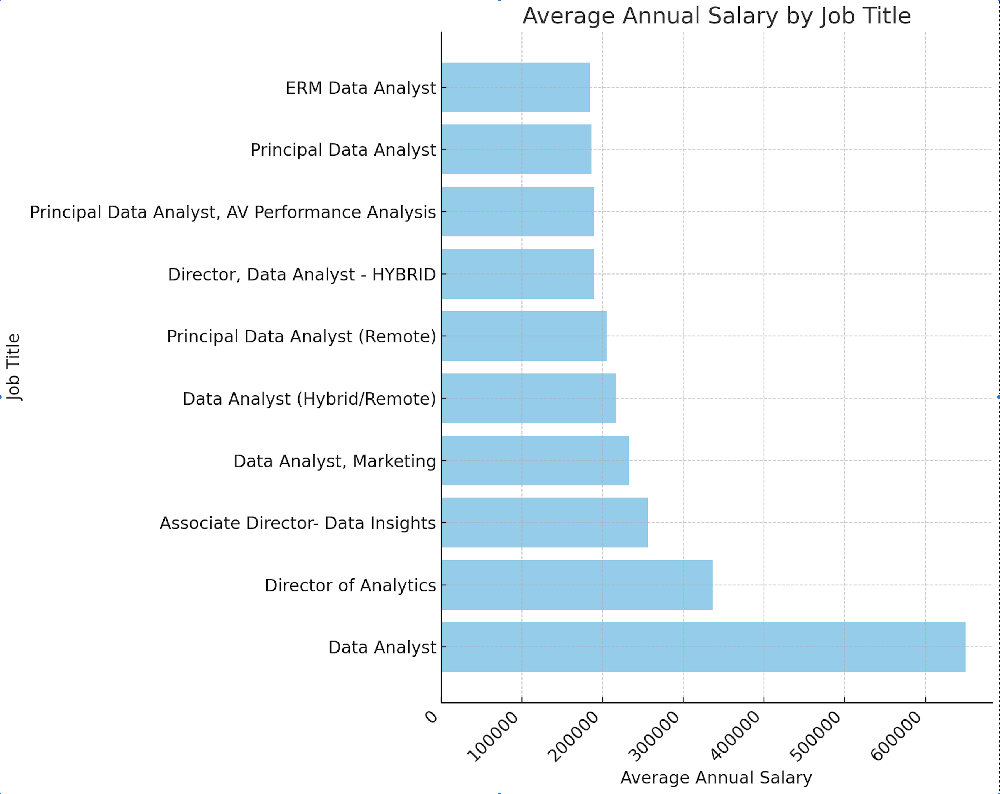

# Intoduction
Dive into the data job market! Focusing on data analyst roles, this project explores top-paying jobs, in-demand skills, and where high demand meets high salary in data analystics.
SQL queries? Check them out here: [project_sql folder](/project_sql/)
# Background
Driven by a quest to navigate the data analyst job market more effectively, this project was born from a desire to pinpoint top-paid and in-demand skills, streamlining others work to find optimal jobs.

### The questions I wanted to answer through my SQL queries were:

1. What are the top-paying data analyst jobs?
2. What skills are required for these top-paying jobs?
3. What skills are most in demand for data analysts?
4. Which skills are associated with higher salaries?
5. What are the most optimal skills to learn?

# Tools I used
For my deep dive into the data analyst job market, I harnessed the power of several key tools:
- **SQL**
- **PostgreSQL**
- **Visual Studio Code**
- **Git & GitHub**

# The Analysis
Each query for this project aimed at investigating specific aspects of the data analyst job market. Here's how I approached each questions:

### 1. Top Paying Data Analysis Jobs

```sql
SELECT
    job_id,
    job_title,
    company_dim.name AS company_name,
    job_location,
    job_schedule_type,
    salary_year_avg,
    job_posted_date
FROM
    job_postings_fact
LEFT JOIN company_dim 
    ON job_postings_fact.company_id = company_dim.company_id
WHERE
    job_title_short = 'Data Analyst' AND
    job_location = 'Anywhere' AND
    salary_year_avg IS NOT NULL
ORDER BY salary_year_avg DESC
LIMIT 10;
```


# What I Learned

- **Complex Query Crafting**
- **Data Aggregation**
- **Analytical Wizardry**


# Conclusions
1. **Top-paying data analyst jobs:** The highest-paying jobs for data analysts that allow remote work offer a wide range of salaries, the highest at $650,000!


